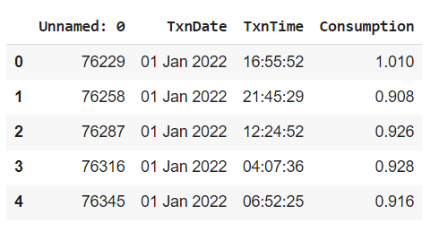
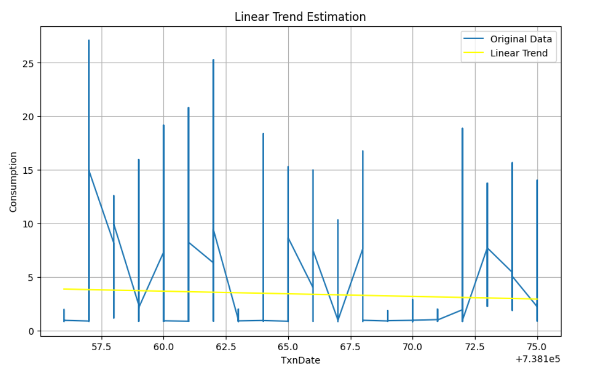
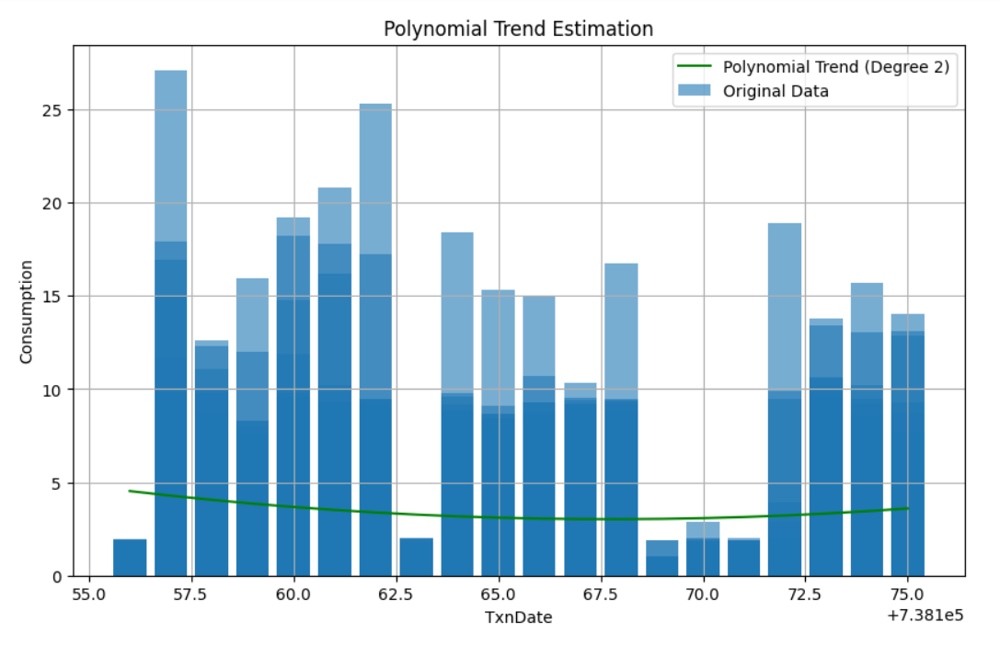

### Developed by: Shaik Shoaib Nawaz
### Register No: 212222240094
# Ex.No: 02 LINEAR AND POLYNOMIAL TREND ESTIMATION
Date:
### AIM:
To Implement Linear and Polynomial Trend Estiamtion Using Python.

### ALGORITHM:
1. Import necessary libraries (NumPy, Matplotlib)
2. Load the dataset
3. Calculate the linear trend values using least square method
4. Calculate the polynomial trend values using least square method
5. End the program
### PROGRAM:
#### A - LINEAR TREND ESTIMATION
```
Name :Shaik Shoaib Nawaz
Register No: 212222240094
import pandas as pd
import numpy as np
import matplotlib.pyplot as plt
from sklearn.linear_model import LinearRegression
from sklearn.preprocessing import PolynomialFeatures
data=pd.read_csv('/content/KwhConsumptionBlower78_1.csv')
data.head()
data['TxnDate'] = pd.to_datetime(data['TxnDate'])
data = data.sort_values('TxnDate')
data['TxnDate'] = data['TxnDate'].apply(lambda x: x.toordinal())
X = data['TxnDate'].values.reshape(-1, 1)
y = data['Consumption'].values
linear_model = LinearRegression()
linear_model.fit(X, y)
data['Linear_Trend'] = linear_model.predict(X)
plt.figure(figsize=(10,6))
plt.plot(data['TxnDate'], data['Consumption'],label='Original Data')
plt.plot(data['TxnDate'], data['Linear_Trend'], color='yellow', label='Linear Trend')
plt.title('Linear Trend Estimation')
plt.xlabel('TxnDate')
plt.ylabel('Consumption')
plt.legend()
plt.grid(True)
plt.show()
```
#### B- POLYNOMIAL TREND ESTIMATION
```
poly_features = PolynomialFeatures(degree=2)
X_poly = poly_features.fit_transform(X)
poly_model = LinearRegression()
poly_model.fit(X_poly, y)
data['Polynomial_Trend'] = poly_model.predict(X_poly)
plt.figure(figsize=(10,6))
plt.bar(data['TxnDate'], data['Consumption'], label='Original Data', alpha=0.6)
plt.plot(data['TxnDate'], data['Polynomial_Trend'],color='green', label='Polynomial Trend (Degree 2)')
plt.title('Polynomial Trend Estimation')
plt.xlabel('TxnDate')
plt.ylabel('Consumption')
plt.legend()
plt.grid(True)
plt.show()
```
### Dataset:

### OUTPUT
A - LINEAR TREND ESTIMATION


B- POLYNOMIAL TREND ESTIMATION


### RESULT:
Thus the python program for linear and Polynomial Trend Estiamtion has been executed successfully.
